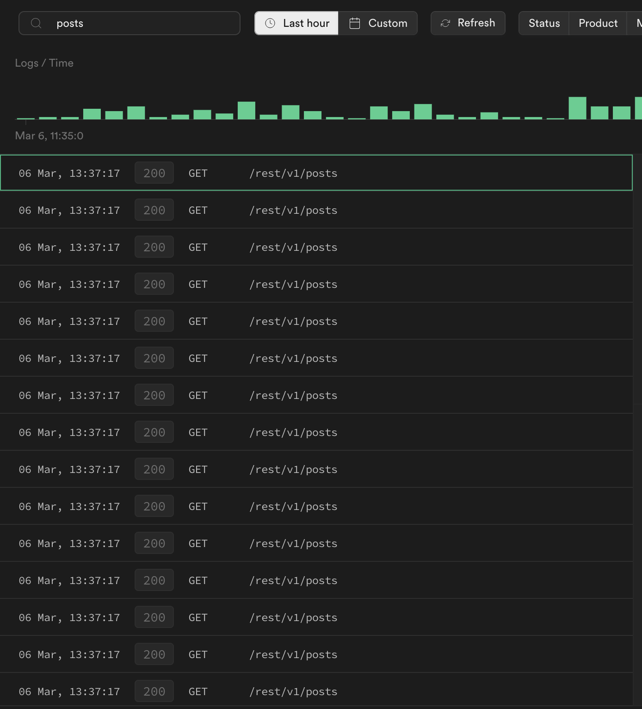

# Supabase with NextJS 13 to test request deduping

## Getting Started

First, run the development server:

```bash
npm run dev
# or
yarn dev
# or
pnpm dev
```

Open [http://localhost:3000](http://localhost:3000) with your browser to see the result.

## Notes

### Static

- Request deduplication for static does not work, generates 20 supabase requests at `npm run build`.



### Dynamic

- Request deduplication seems to work. Only one request is sent per page.
- Request deduplication does not work between pages, even though same layout.

## Links

- [Supabase blog - Fetching and caching Supabase data in Next.js 13 Server Components](https://supabase.com/blog/fetching-and-caching-supabase-data-in-next-js-server-components)
- [Next13 doc - Automatic fetch() Request Deduping](https://beta.nextjs.org/docs/data-fetching/fundamentals#automatic-fetch-request-deduping)
